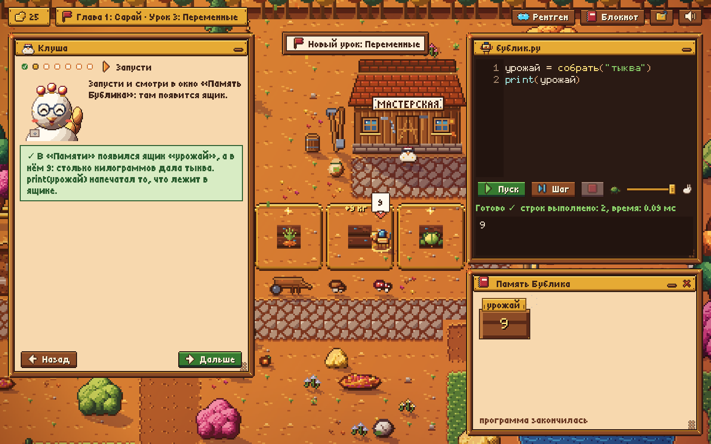
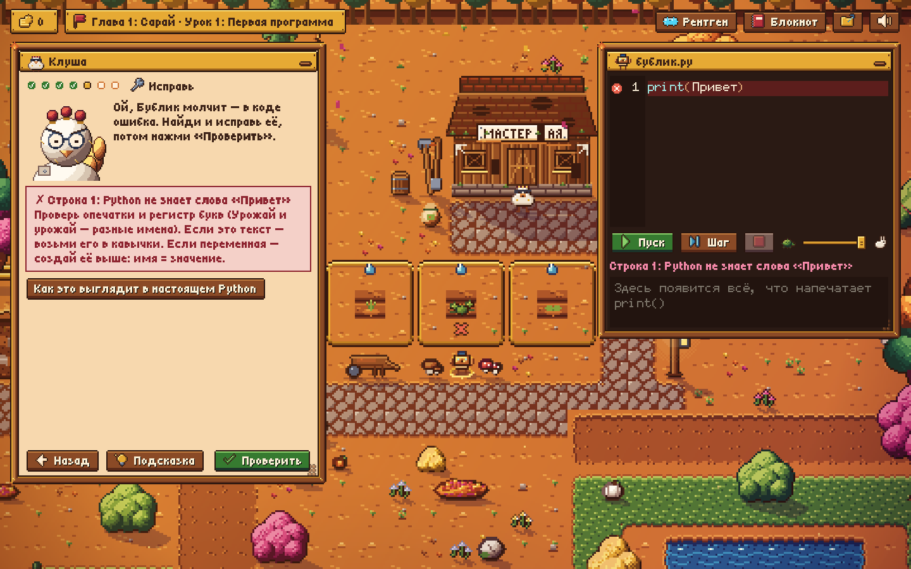
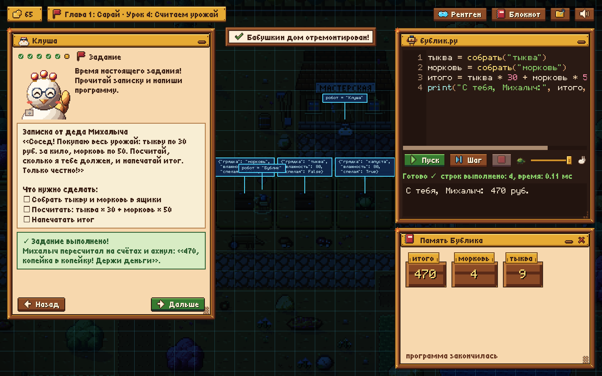
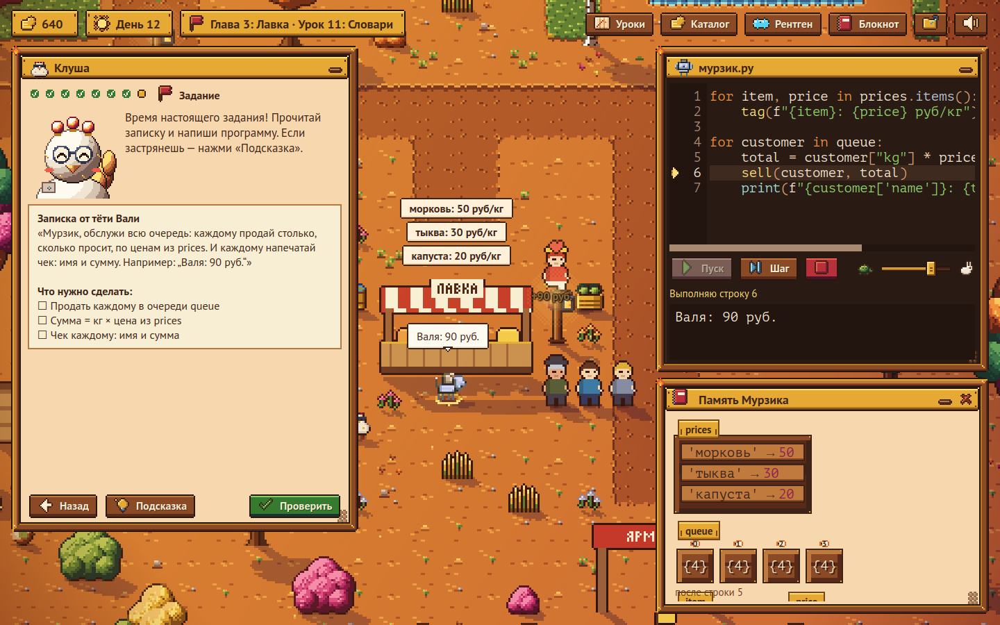
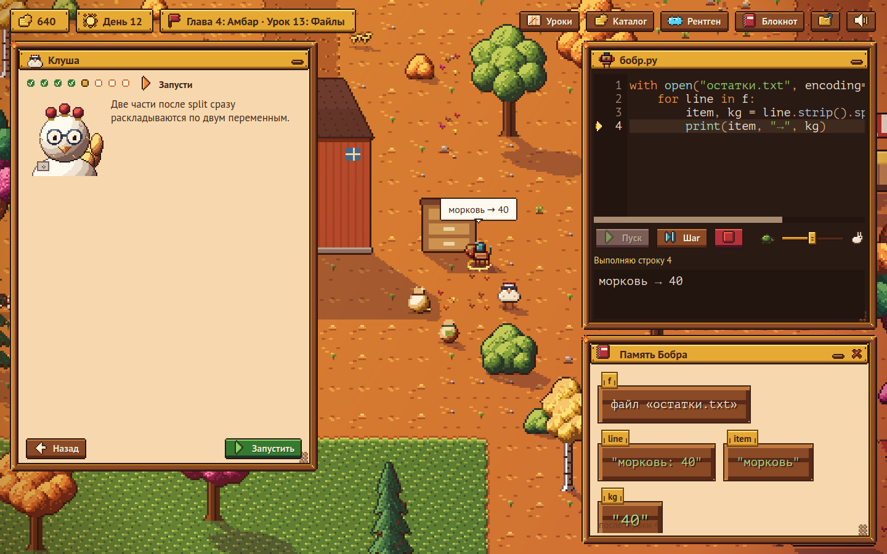
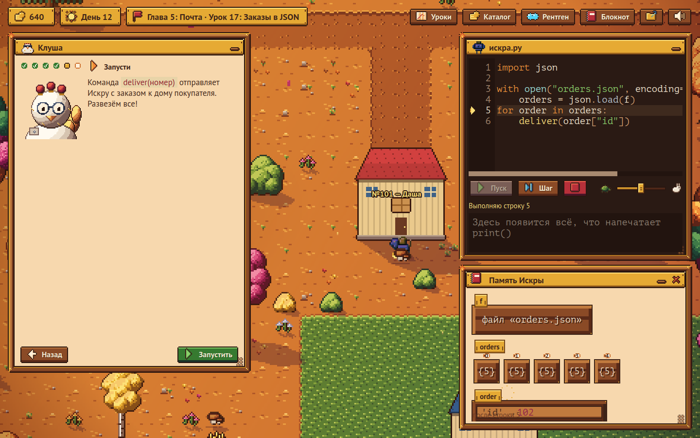
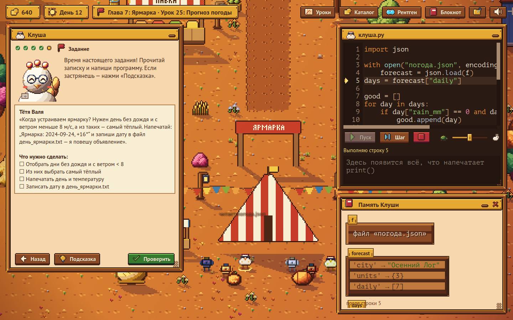

# Робоферма

Обучающая игра для Mac: учишь **настоящий Python**, программируя команду робо-животных на бабушкиной ферме.
Как *The Farmer Was Replaced*, но каждая строчка кода сразу показывает, где она пригодится в жизни.



- **Пиксельный мир** в духе Stardew Valley: уютная осень, тени, листопад, свечение фонарей.
- **Семь глав и 26 уроков:** от первого `print` до программ, которые читают файлы, разбирают JSON и пишут отчёты для Excel.
- **Робокурица Клуша** ведёт уроки маленькими шагами: смотри, запусти, допиши, исправь, напиши сам.
- **Пошаговый запуск:** строка кода подсвечивается, а робот в тот же момент делает действие в мире.
- **«Память робота»:** переменные нарисованы ящиками с табличками.
- **Ошибки по-русски:** забытые кавычки, двоеточие, не та раскладка, английская буква в русском слове.
- **Рентген** (клавиша R): мир превращается в данные, которые видит программа.
- **Настоящие файлы:** с главы 4 роботы работают с файлами в папке `Документы/Робоферма` на твоём Mac — их можно открыть в Finder, Numbers и Excel. Скрипты из этих глав запускаются и без игры: `python3 бобр.py`.
- **Честная проверка:** каждое задание проверяется ещё и на «данных следующего дня», поэтому ответ, вписанный руками, не пройдёт.
- **После каждого задания:** разбор решения и карточка «В жизни» с примерами и подсказкой, как попробовать код в Терминале.
- **Экономика:** монеты за задания, роботы сами работают каждый игровой день и приносят доход, бабушкин каталог украшений фермы.
- **Звуки и музыка:** ретро-эффекты, голоса роботов и осенняя мелодия.

| Ошибка по-русски | Рентген: мир глазами программы |
|---|---|
|  |  |

## Главы

| Глава | Робот | Чему учит | Где пригодится |
|---|---|---|---|
| 1. Сарай | пёс Бублик | `print`, команды, переменные, арифметика | любой расчёт: бюджет, скидка, проценты |
| 2. Поле | пёс Бублик | списки, `for`, `if/else`, `and/or`, счётчики | автополив, умный дом, «если меньше порога — сделай» |
| 3. Лавка | кот Мурзик | английские имена, f-строки, словари, функции | шаблоны писем и SMS, прайс-листы, чеки и скидки |
| 4. Амбар | бобр Бобр | файлы, CSV, `try/except`, отчёты для Excel | выгрузки из банка и кассы, сводные таблицы |
| 5. Почта | лошадка Искра | JSON, вложенные данные, `sorted`, даты | данные сайтов: заказы, погода, курсы валют |
| 6. Контора | сова Ухта | `pathlib`, папки, переименование, много файлов | порядок в «Загрузках», тысячи фото, еженедельные отчёты |
| 7. Ярмарка | вся команда | погода из JSON, таблица из Excel, финальный проект | «Что дальше»: свои задачи из жизни и работы |

| Лавка: очередь и ценники | Амбар: Бобр читает настоящий файл |
|---|---|
|  |  |

| Почта: Искра развозит заказы | Ярмарка: финальный проект |
|---|---|
|  |  |

## Как запустить

### Вариант 1. Готовое приложение

1. Откройте вкладку **Actions** в репозитории на GitHub и выберите последний успешный запуск «Сборка для Mac».
   Если нужной сборки нет, запустите её сами: «Сборка для Mac» → **Run workflow** → выберите ветку → **Run workflow**. Сборка займёт около 5 минут.
2. Внизу страницы, в разделе **Artifacts**, скачайте `Robofarm-mac`. Распакуйте архив и перенесите `Robofarm.app` в «Программы».
3. Приложение не подписано платным сертификатом Apple, поэтому при первом запуске macOS его заблокирует. Чтобы открыть:
   - **macOS 14 и старше:** правый клик по приложению → «Открыть» → «Открыть».
   - **macOS 15 и новее:** «Системные настройки» → «Конфиденциальность и безопасность» → внизу «Всё равно открыть».

   Есть и третий способ: в Терминале выполнить `xattr -cr /Applications/Robofarm.app`.

Сборка рассчитана на Mac с процессором Apple (M1 и новее). На Mac с Intel используйте вариант 2.

### Вариант 2. Из Терминала

1. Установите Python 3.11 или новее с [python.org](https://www.python.org/downloads/).
2. В Терминале, в папке с игрой, выполните:

```bash
pip3 install -r requirements.txt
python3 main.py
```

## Управление

| Действие | Как |
|---|---|
| Запустить код | кнопка «Пуск» или Cmd + Enter |
| Выполнить одну строку | кнопка «Шаг» |
| Скорость | ползунок от черепахи к зайцу |
| Двигать камеру | перетащить мышью или стрелками / WASD |
| Приблизить | колесо мыши |
| Рентген | кнопка «Рентген» или клавиша R |
| Скрипт робота | клик по роботу |
| Повторить любой пройденный урок | кнопка «Уроки» |
| Украшения для фермы | кнопка «Каталог» |

Окна можно таскать за заголовок, сворачивать и менять их размер за уголок.

## Где хранятся файлы

- **Скрипты роботов глав 1–3:** `~/Documents/Робоферма/скрипты/` (`бублик.py`, `мурзик.py`). Это настоящие файлы, их можно открыть в любом редакторе.
- **Главы 4–7:** у каждой своя папка — `амбар`, `почта`, `контора`, `ярмарка`. В ней лежат файлы данных урока и скрипт робота. Скрипт запускается и без игры: `cd ~/Documents/Робоферма/амбар && python3 бобр.py`.
- Игра заново раскладывает файлы урока при каждом запуске кода, поэтому свои файлы в эти папки лучше не класть.
- Кнопка с папкой на верхней панели открывает папку текущей главы в Finder.
- **Сохранение игры:** `~/Library/Application Support/Робоферма/save.json`.

## Для разработчиков

```
main.py                    запуск игры (и песочницы с флагом --sandbox)
robofarm/game.py           ход игры: главы, уроки, проверки, награды, игровые дни, сохранения
robofarm/lessons/          уроки: каркас шагов, данные уроков, главы 1–7, общий запуск (runtime.py)
robofarm/catalog.py        бабушкин каталог украшений
robofarm/sandbox/          выполнение кода игрока в отдельном процессе + объяснения ошибок
robofarm/replay.py         проигрывание записанных шагов анимацией
robofarm/world/            карта, роботы, отрисовка мира (свет, тени, туман, рентген)
robofarm/ui/               пиксельные окна, редактор кода, «Память робота», шрифты
robofarm/sound.py          звук (afplay на Mac)
robofarm/data/assets.json  вся графика: палитра и спрайты в виде данных (сделано в Claude Design)
tools/                     генераторы звуков и иконки, автопрогон всех глав со скриншотами (play_all.py)
tests/                     проверки уроков и песочницы: python3 -m pytest tests
```

**Как добавить урок.** Опишите его в файле главы (`robofarm/lessons/chapterN.py`) по образцу: шаги, проверки, задание, разбор, карточка «В жизни». Данные урока (грядки, очередь, файлы, заказы) задаёт функция `data(вариант)`: вариант 0 видно в мире, остальные — скрытые «данные следующего дня». Правильные ответы и типичные ошибки добавьте в `tests/solutions.py`: тесты сами проверят, что эталон проходит на всех вариантах, а заготовка и ошибки — нет. Игра и тесты запускают код одинаково, через `robofarm/lessons/runtime.py`.

Полный автопрогон игры со снимками экрана: `python3 tools/play_all.py <папка> [первая глава] [последняя глава]`.

## Авторство и лицензии

- **Графика:** сделана в Claude Design специально для этой игры. Промты лежат в `docs/`.
- **Шрифты:** [PT Sans](https://fonts.google.com/specimen/PT+Sans), [PT Mono](https://fonts.google.com/specimen/PT+Mono) и [Press Start 2P](https://fonts.google.com/specimen/Press+Start+2P) — SIL Open Font License, тексты лицензий в `robofarm/data/fonts/`.
- **Звуки и музыка:** синтезированы кодом (`tools/make_sounds.py`).

Концепция игры: [docs/CONCEPT.md](docs/CONCEPT.md).
